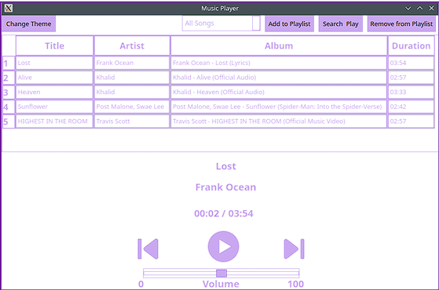

# Qt Music Player 🎵🎧

A fully featured GUI music player built in **C++** using **Qt**, designed to interface with **MPD (Music Player Daemon)** via **libmpdclient**. This project transforms a command-line music player into a modern, customizable graphical experience for Linux users.

---

## Features

-  **Playback Controls**: Play, pause, stop, next, previous, and volume slider
-  **Playlist Management**: Create, edit, and save playlists
-  **Library View**: Search and filter songs by metadata (artist, album, genre)
-  **Themes**: Light and dark mode via Qt Stylesheets
-  **Now Playing Display**: Track title, artist, album info with icons
-  **Transcoding Support**: MP3, WAV, FLAC playback via MPD

---

## Requirements

Ensure the following are installed on your Linux system:

- `mpd` (Music Player Daemon)
- `libmpdclient` (C++ API for interfacing with MPD)
- `qt5` or `qt6` (Qt Creator or libraries for building the GUI)

You can install them using:

```bash
sudo apt install mpd libmpdclient-dev qtbase5-dev qt5-qmake qtcreator
```

---

## ⚙️ Setup Instructions

1. Clone this repository:
   ```bash
   git clone https://github.com/YOUR_USERNAME/qt-music-player.git
   cd qt-music-player
   ```

2. Configure MPD:
   - Edit `/etc/mpd.conf` to set your `music_directory` and `audio_output`.
   - Example:
     ```
     music_directory    "~/Music"
     audio_output {
         type            "pulse"
         name            "PulseAudio Output"
     }
     ```

3. Build the application using Qt:
   - Open `make.pro` in Qt Creator
   - Or build via terminal:
     ```bash
     qmake make.pro
     make
     ./MusicPlayer
     ```

---

##  Architecture

- **MPD Backend**: Handles actual audio playback
- **libmpdclient**: Communicates with MPD server
- **Qt Widgets**: Buttons, sliders, combo boxes for GUI
- **Stylesheets**: Applied dynamically to switch themes

---

## 📸 Screenshots




---

*Built by Maria Boxwala & Zunaira Farooq — CMP310 Project @ AUS*

